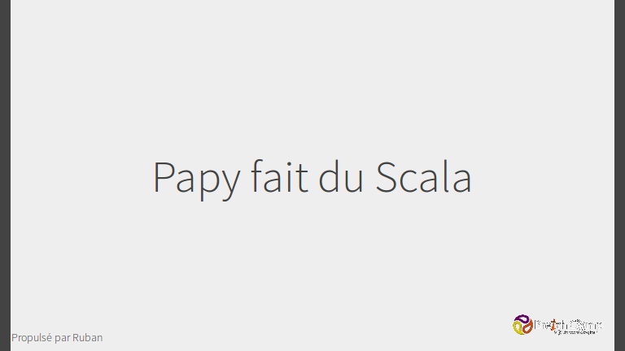

J'ai eu le plaisir de participer au [BreizhCamp 2013](http://2013.breizhcamp.org/), à la fois en tant que visiteur mais aussi en tant qu'orateur.

<!-- more -->

J'y ai présenté la conférence "Papy fait du Scala", dont voici le support de présentation :

Et la vidéo :

{{ youtube(id="ZXBfVUAfDuM") }}
