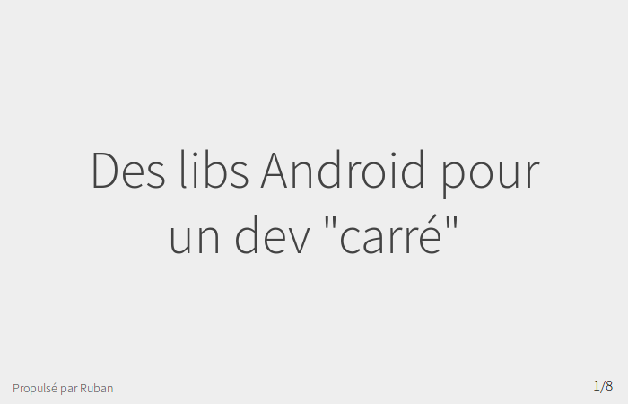

Le [GDG Nantes](http://gdgnantes.com) m'a invité à venir présenter les fantastiques librairies de développement Android de Square le 16 juin 2014 au soir.

<!-- more -->

Merci pour l'apéro et pour le public !

Support de présentation :

