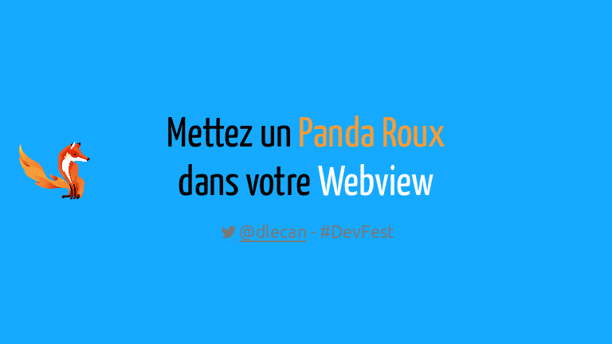

J'ai eu le plaisir de participer à cette superbe conférence que fut le [Devfest Nantes 2014](http://devfest.gdgnantes.com/), à la fois en tant que visiteur mais aussi en tant qu'orateur.

<!-- more -->

J'y ai présenté la conférence "Mettez un Panda Roux dans votre Webview", dont voici le résumé :

>Au-delà du simple navigateur pour Android, Firefox est aussi une plateforme d'exécution d'applications HTML5 ouverte, les Open Web Apps.
>Après une présentation de Mozilla Geckoview et de ce qu'il peut apporter à vos applications HTML5 sous Android par rapport à une Webview standard (modernité, performances...), nous détaillerons l'initiative de Mozilla avec les Open Web Apps et verrons concrètement comment l'utiliser pour déployer des applications HTML5 sous Android.

Et le support de présentation :

La vidéo :

{{ youtube(id="SBzsADcBdBE") }}
