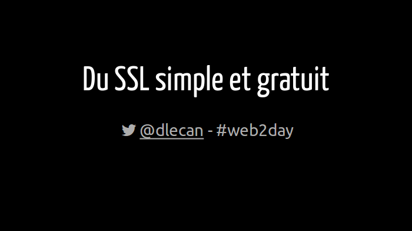

J'ai été retenu par la prestigieuse conférence [Web2Day](https://web2day.co) à Nantes pour présenter ["Du SSL gratuit pour tous"](https://web2day.co/2016/evenements/du-ssl-gratuit-pour-tous/) en juin 2016.

<!-- more -->

Dans cette conférence, je démontre comment configurer du TLS/SSL sur votre site web très facilement à l'aide de la nouvelle autorité de certification [Let's Encrypt](https://letsencrypt.org/).
Elle délivre gratuitement des certificats.

Merci !

Les support de présentation :

