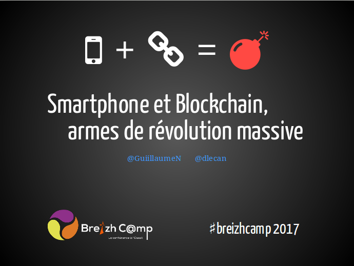

J'ai eu le plaisir co-animer avec [GuiillaumeN](https://twitter.com/guiillaumeN) au [Breizhcamp 2017](http://www.breizhcamp.org/) une conférence sur la blockchain.

<!-- more -->

Les slides de la présentation "Smartphone et Blockchain, armes de révolution massive" sont disponibles sur Github :

