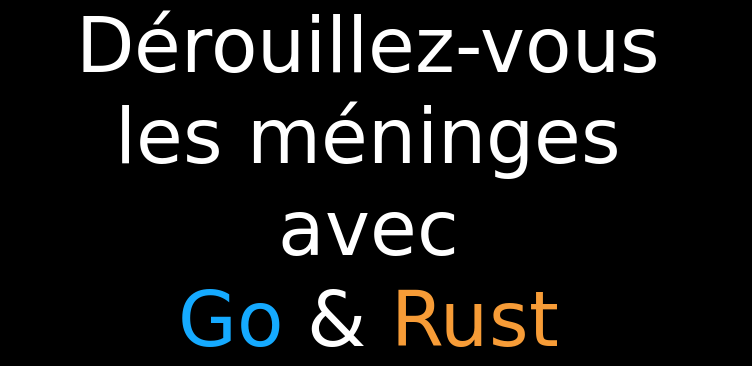

[Go](https://golang.org/) et [Rust](https://www.rust-lang.org/) font partie de ses "nouveaux" langages très excitants : à la fois modernes mais aussi très puissants.
Je les ai présentés et comparés lors de ce meetup organisé par [SQLI Nantes](http://www.sqli.com/) en juillet 2015.

<!-- more -->

Support de présentation :

La vidéo (à partir de 66' pour ma conférence "Go & Rust") :

{{ youtube(id="OKg9gIs6W0Y") }}
