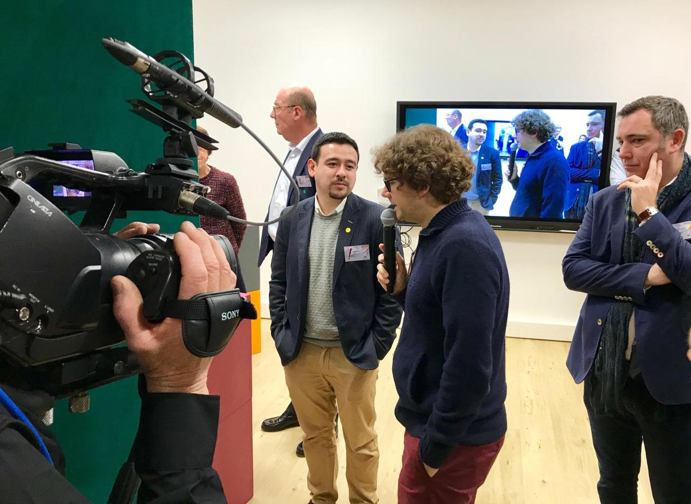

[Laure Merlin](https://twitter.com/lauremerlin) et moi avons animé un *serious game* grandeur nature sur le thème de la Blockchain pour l'inauguration de [l'incubateur de start-ups nantais Novapuls](https://novapuls.fr/).

<!-- more -->

Cet atelier, nommé "Jouons à la Blockchain" a eu lieu le mercredi 05 décembre 2018.

Par groupe de 4-6 personnes, la quarantaine de participants a joué à la Blockchain avec des Legos : miner par preuve de travail (Proof-of-Work - PoW) ou preuve de possession (Proof-of-Stake - PoS), diffuser des informations ou des blocs, enregistrer des informations, résister à des *hacks*, executer des _smart-contracts_ ... tout le monde s'est pris au jeu !

Quelques images :

<blockquote class="twitter-tweet">
[Inauguration <a href="https://twitter.com/Novapuls_ouest?ref_src=twsrc%5Etfw">@Novapuls_ouest</a> ] Tout comprendre sur la <a href="https://twitter.com/hashtag/blockchain?src=hash&amp;ref_src=twsrc%5Etfw">#blockchain</a> avec <a href="https://twitter.com/lauremerlin?ref_src=twsrc%5Etfw">@lauremerlin</a> et <a href="https://twitter.com/dlecan?ref_src=twsrc%5Etfw">@dlecan</a>. Jouons aux legos chez <a href="https://twitter.com/SoderoGestion?ref_src=twsrc%5Etfw">@SoderoGestion</a> pour comprendre le noeud, le bloc, le minage, la fraude, le smart contract,... <a href="https://t.co/cUlpvbqvJF">pic.twitter.com/cUlpvbqvJF</a>
&mdash; Amélie André (@Amelie_novapuls) <a href="https://twitter.com/Amelie_novapuls/status/1070236752076517376?ref_src=twsrc%5Etfw">December 5, 2018</a></blockquote>

<blockquote class="twitter-tweet">
<a href="https://twitter.com/hashtag/Inauguration?src=hash&amp;ref_src=twsrc%5Etfw">#Inauguration</a> 🚀 l Atelier conférence : Jouons ensemble à la <a href="https://twitter.com/hashtag/Blockchain?src=hash&amp;ref_src=twsrc%5Etfw">#Blockchain</a> par <a href="https://twitter.com/dlecan?ref_src=twsrc%5Etfw">@dlecan</a> CTO de <a href="https://twitter.com/UnikName_Uns?ref_src=twsrc%5Etfw">@UnikName_UNS</a> et <a href="https://twitter.com/lauremerlin?ref_src=twsrc%5Etfw">@lauremerlin</a> CEO de <a href="https://twitter.com/ChainSpring?ref_src=twsrc%5Etfw">@ChainSpring</a> 😉 <a href="https://twitter.com/hashtag/startups?src=hash&amp;ref_src=twsrc%5Etfw">#startups</a> <a href="https://twitter.com/hashtag/cryptocurrency?src=hash&amp;ref_src=twsrc%5Etfw">#cryptocurrency</a> <a href="https://t.co/ffbDhNIdTc">pic.twitter.com/ffbDhNIdTc</a>
&mdash; Novapuls (@Novapuls_ouest) <a href="https://twitter.com/Novapuls_ouest/status/1070233162565996544?ref_src=twsrc%5Etfw">December 5, 2018</a></blockquote>  

Un succès aux dires des participants et des organisateurs 😅

Merci au public présent et à Novapuls pour sa confiance.
